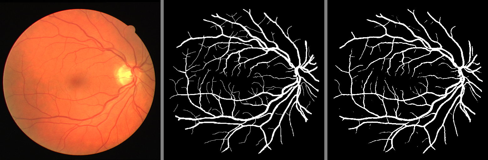
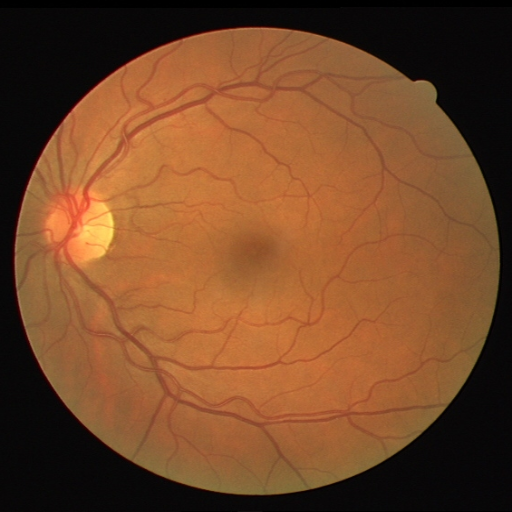
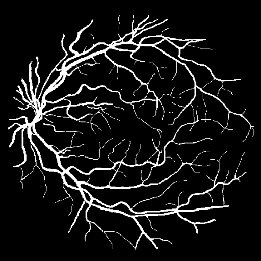

# Fundus Datasets

data/fundus/DRIVE_JPG: the DRIVE dataset, converted to jpg.   
data/fundus/SEH: pediatric fundus images from SEH (Shenzhen Eye Hospital)  

# Run

Revise dataset and weight paths in `train.py` and `test.py`, then run:  
```
python train.py  
python test.py
```

# Segmentation Model

|  |
| :--: |
| *U-Net* |

The default model weights are trained by DRIVE.

# Weight

The original weight file: [checkpoint.pth](https://drive.google.com/file/d/1Wl7-E6Tk3YpeJ7GIYScGvUeW9ou474yy/view?usp=sharing)

test.py will output images containing:
1. Input image
2. Ground truth 
3. Predicted mask

|  |
| :--: |
|  |
|  |
|  |


# Reference

[Retina-Blood-Vessel-Segmentation-in-PyTorch](https://github.com/nikhilroxtomar/Retina-Blood-Vessel-Segmentation-in-PyTorch/blob/main/README.md)

Original Image             |  Mask Image
:-------------------------:|:-------------------------:
  |  